# Rangkuman Arsitektur Jaringan Terkini

Tugas Akhir AJT Mahasiswa Tekkom Universitas Brawijaya

Author: Adytia Candra WIbawa
<hr>

# Langkah Awal Persiapan

Sebelum memulai praktikum, kita terlebih dahulu menyiapkan insfrastruktur dan media yang dibutuhkan menggunakan mesin  AWS EC2. Untuk menjalankan terlebih dahulu kita membuka website berikut:

[AWS ACADEMY](https://awsacademy.instructure.com/)

Maka akan masuk seperti tampilan berikut:


>Note: Silahkan pilih yang student Login, kemudia Masuk sesuai akun Anda. 

Kemudian maka akan tampil halaman berikut ini:


>Note: Pilih kelas sesuai arahan Dosen Anda.

Setelah semuanya selesai, maka langkah selanjutnya adalah menjalankan __Vocareum Labs__, dan akan masuk ke dalam halaman pengkodingan. Untuk lebih jelasnya, akan dijelaskan pada bab berikutnya bagaimana cara membuat mesin __EC2__ melalui __Vocareum Labs__.

Untuk mmelihat __Vocareum Labs__ dapat dilakukan dengan masuk ke:

**Course** > **Vocareum Labs**
<hr>

## Membuat Mesin EC2 Melalui Vocareum Labs di AWS ACADEMY

Setelah Anda masuk __Vocareum Labs__ akan masuk ke dalam halaman pengkodingan seperti berikut ini:


Secara umum halaman di Vocareum Labs, membantu kita untuk melakukan pengkodingan langsung pada mesin yang akan dibuat. Dalam Vocareum Labs terdapat beberapa tombol yang akan dijelaskan sebagai berikut.

- **Start Lab** : Digunakan untuk memulai menjalankan mesin AWS.
- **End Lab** : Digunakan untuk mengakhiri mesin AWS, agar kredit tidak terus bertambah.
- **Time** : Mengetahui waktu penggunaan mesin yang telah dijalankan *(Waktu ini memiliki waktu hitung mundur selama **4 Jam**, perhatikan waktu ini karena akan mempengaruhi kredit Anda)*.
- **Credit** : Kredit ini dapat digunakan untuk melihat status kredit yang digunakan, untuk free tier *(Amazon hanya memberi **$100**)*. Jadi gunakan secara baik-baik.
- **AWS Indicator** : Tekan tombol ini masuk dan memilih mesin EC2. Selain itu, digunakan untuk mengetahui apakah mesin AWS sudah berjalan atau tidak. 
    
    - **Merah** : Mesin AWS tidak berjalan.
    - **Hijau** : Mesin AWS berjalan.

Langkah selanjutnya, adalah kita menekan tombol **AWS**, kemudian akan membuat mesin dengan spesifikasi berikut:

- Name and tags: **Tugas Akhir**
- OS Images: **Ubuntu Server 22.04 LTS 64 bit**
- Instance type: **t2.medium**
- Key pair: **vockey**
- Edit Network settings: **allow SSH, allow HTTP, allow HTTPS, allow TCP port 8080, allow TCP port 8081**
- Configure storage: **30 GiB, gp3**


Pertama, kita masuk ke **AWS**, kemudian pilih **EC2**, kemudian **Instances** dan menampilkan halaman berikut:


>Note: Pilih **Launch Instances** untuk membuat mesin baru.

Kedua, langkah-langkah untuk membuat 1 mesin **EC2 Instance** di AWS Console sebagai berikut:

1. Pilih AMI (Amazon Machine Image):
    
    >Note: **Ubuntu Server 20.04 LTS (HVM), SSD Volume Type**
2. Pilih Instance type **t2.medium**:
    
3. Tambahkan penyimpanan:
    
    >Note: Configure storage: **30 GiB, gp3**
4. Tuliskan nama Tags: 
    
    >Note: Name and tags: **Tugas Akhir**
5. Pilih port dari *Network Setting* sebagai berikut:
    
 
    Type Protocol | Port|
    ---|---
    SSH | 27 |
    HTTP | 80 |
    HTTPS | 433 |
    TCP | 8080 |
    TCP | 8081 |

6. Kemudian pilih **Review** dan **Launch**. Maka akan tampil halaman berikut ini, kita memilih *key pair* secara default yaitu __Vockey__.
    

Selamat, mesin Anda telah dibuat dan akan masuk ke daftar mesin yang telah Anda buat. Langkah selanjutnya, kita akan menginstall beberapa aplikasi dalam Linux, yang akan digunakan untuk langkah praktikum. 

*Note: Jangan lupa untuk memeriksa update software. Dengan perintah*
```
$ sudo apt -yy update && sudo apt -yy upgrade
```


<hr>

# Instalasi Mininet

## Apakah itu Mininet?
Mininet adalah sebuah emulator jaringan yang dapat digunakan untuk membuat sebuah jaringan virtual (dapat terdiri atas *host*, *switch*, *router*, *controller*, dan *link*). Host pada mininet menjalankan software Linux standar dan switch pada mininet mendukung protokol **OpenFlow** yang sangat fleksibel untuk dimodifikasi dan mendukung Software-Defined Networking (SDN). Lebih lanjut dapat merujuk ke http://mininet.org/overview/

Untuk melakukan instalasi pada Mesin kita dapat masuk ke **Terminal AWS** dan menghubungkan mesin yang telah dibuat tadi.

>Pilih mesin kemudian klik **Connect** akan masuk sebagai berikut. 
>Kemudian Jalankan dengan perintah pada terminal berikut:
>``` 
>$ ssh -i .ssh/labsuser.pem ubuntu@ec2-52-91-249-20.compute-1.amazonaws.com
>```
>Maka akan keluar halaman seperti berikut ini.
>image.png

Langkah-langkah instalasi Mininet:
1. Melakukan clone aplikasi Mininet pada github dengan sintaks berikut
```
$ git clone https://github.com/mininet/mininet
```


> Mengunduh repositori mininet, dalam contoh untuk version mininet 2.3.0
2. Install Mininet dengan sintaks berikut
```
$ mininet/util/install.sh -nfv
```


>Instalasi untuk mininet, user switch dan OpenFlow

<hr>

# Instalasi RYU Controller

## Apa itu RYU?
Ryu adalah sebuah framework software untuk SDN Controller dan pengembangan aplikasi SDN dan menyediakan beragam komponen software lengkap dengan API yang memudahkan pengembang melakukan pembuatan aplikasi berbasis controller SDN. Referensi lebih lanjut dapat mengakses https://ryu-sdn.org/

Langkah-langkah instalasi RYU:
1. Melakukan clone aplikasi RYU pada github dengan sintaks berikut
```
$ git clone https://github.com/osrg/ryu.git
```


> Mengunduh repositori ryu
2. Install RYU dengan sintaks berikut
```
$ cd ryu
$ pip install .
$ cd
```


<hr>

# Instalasi Flow Manager

## Apa itu Flow Manager?
FlowManager adalah aplikasi pengontrol RYU yang memberikan kontrol manual pengguna atas tabel aliran di jaringan OpenFlow. Pengguna dapat membuat, memodifikasi, atau menghapus alur langsung dari aplikasi. Pengguna juga dapat memantau sakelar OpenFlow dan melihat statistik. FlowManager sangat ideal untuk mempelajari OpenFlow di lingkungan lab, atau bersama dengan aplikasi lain untuk mengubah perilaku alur jaringan di lingkungan pengujian. Referensi lebih lanjut dapat mengunjungi https://github.com/martimy/flowmanager/

Langkah-langkah melakukan clone FlowManager pada terminal dengan sintaks berikut
```
$ git clone https://github.com/martimy/flowmanager
cd
```


<hr>

Semua bahan telah di download dan di install. Kemudian lakukanlah praktikum seseuai dengan aplikasi yang ingin anda buat. 

> *Note: Setelah langkah instalasi Flowmanager, sebaiknya lakukan rebooting Linux anda untuk membuat lingkungan operasional Python, Mininet, Ryu dan OpenFlow dapat berjalan dengan baik.*

<br>
<br>

# Menjalankan Mininet
Sebelum mengikuti prosedur berikutnya, perlu memperhatikan hal berikut:

Perintah | Keterangan
---|---
|`$` | user shell prompt, dimana setelahnya anda akan mengetikkan perintah-perintah Linux |
|`mininet>` | mininet CLI prompt, dimana setelahnya anda akan mengetikkan perintah-perintah pada Mininet
| `#` | root shell prompt, dimana setelahnya anda akan mengetikkan perintah-perintah Linux pada level akun root *(berbeda dengan akun user biasa)*

>*Note : Setiap perintah dijalankan / dieksekusi, maka harus diakhiri dengan tombol enter*

Untuk menjalankan mininet terlebih dahulu pastikan terminal terhubung dengan mesin. 

Untuk membuat sebuah topologi ketikan kode berikut:
```
$ sudo mn
```
Perintah tersebut akan menjalankan program di bawah ini :


Program di atas dapat diamati secara tampilan sebagai berikut:


> Keterangan: Dalam program di atas, kita membuat dua host yang bernama **h1** dan **h2**, kemudian membuat satu controller yang bernama **c0** dan satu switch yang bernama **s1**. 

Untuk mengetahui semua **nodes** maka dapat menggunakan sintaks berikut:
```
mininet> nodes
```
Untuk mengetahui **links** pada node maka dapat menggunakan sintaks berikut:
```
mininet> net
```
Untuk mengetahui informasi **informasi nodes** maka dapat menggunakan sintaks berikut:
```
mininet> dump
```
Contoh kode yang telah dijalankan:

>Keterangan:
> 
>- Pada perintah nodes, dapat diketahui hasil nnya ialah sebagai berikut: **c0** adalah controller, **h1** dan **h2** adalah host, **s1** adalah switch. 
> - Pada perintah net, dapat diketahui hubungan atau link, sebagai berikut: h1 dihubungkan melalui **port h1-eth0** dengan **s1-eth1** dan h2 dihubungkan dengan port **h2-eth0** dengan **s1-eth2**. 
>- Pada perintah dump ditampilkan informasi host dan switch beserta alamat ip dan pid-nya. 

Untuk mengetahui sintaks lebih banyak dapat mengakses kode berikut:
```
mininet> help
```


<br>
<br>

## Tes Ping Pada Mininet

Jalankan kode berikut:
```
mininet> pingall
mininet> h1 ping -c 2 h2
```

>Keterangan:
> 
> - Pada perintah **pingall** dapat diartikan semua node saling ping, apabila berhasil maka akan ada hubungan.
> - Pada perintah **h1 ping - c 5 h2**, dapat diartikan **h1** melakukan ping ke **h2**, menggunakan **controller**, dengan **5 kali** ping.
> - Saat perintah tersebut dijalanlkan dapat dilihat **waktu pengiriman** selama beberapa ms, terdapat **informasi mengenai packet loss** dan berapa **paket yang berhasil ditransmisikan**. 

Untuk mengakhiri CLI Mininet dapat menggunakan perintah:
```
mininet> exit
```
<br>
<hr>

# Pelajaran 1: Membuat Custom Topology pada Mininet

## Apa itu Custom Topology?
Custom Topology adalah pembuatan topologi secara bebas dengan mengeksekusi sebuah code oleh mininet. Dalam pembuatan custom topology dapat dilakukan dengan 2 cara, yaitu secara manual dengan menulis kode python atau membuat konfigurasi topologi menggunakan GUI editor seperti *Virtual Network Description (vnd)* kemudian diexport ke bentuk file yang dapat di-running oleh mininet.

Kali ini kita akan membuat custom topology sederhana dengan kasus sebagai berikut.
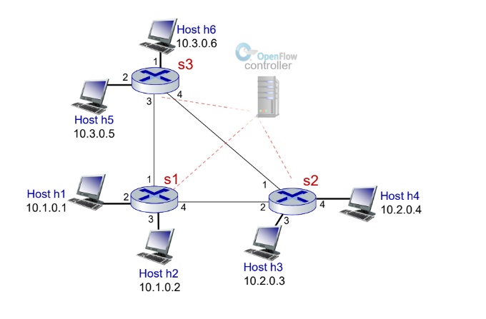

>Keterangan :
> - Terdapat 6 buah host dengan ip masing-masing : 10.1.0.1-10.1.0.6
> - Terdapat 3 buah switch

Sebelum menjalankan program, terlebih dahulu kita membuat file python. Code di bawah ini, dengan nama **custom_topology.py**.

```python
from mininet.topo import Topo
from mininet.cli import CLI
from mininet.log import setLogLevel, info

class MyTopo( Topo ):  
    "Simple topology example."

    def addSwitch(self, name, **opts):
        kwargs ={'protocols':'OpenFlow13'}
        kwargs.update(opts)
        return super(MyTopo, self).addSwitch(name, **kwargs)

    def __init__( self ):
        "Create custom topo."

        # Initialize topology
        Topo.__init__( self )

        # Add hosts and switches
        info('\n***Add Hosts ***\n')
        Host1 = self.addHost( 'h1' , ip='10.1.0.1/24' )
        Host2 = self.addHost( 'h2' , ip='10.1.0.2/24' )
        Host3 = self.addHost( 'h3' , ip='10.2.0.3/24' )
        Host4 = self.addHost( 'h4' , ip='10.2.0.4/24' )
        Host5 = self.addHost( 'h5' , ip='10.3.0.5/24' )
        Host6 = self.addHost( 'h6' , ip='10.3.0.6/24' )

        info('\n***Add Switches ***\n')
        Switch1 = self.addSwitch('s1')
        Switch2 = self.addSwitch('s2')
        Switch3 = self.addSwitch('s3') 

        # Add links
        info('***\nAdd Links for Hosts***\n')
        self.addLink( Host1, Switch1 )
        self.addLink( Host2, Switch1 )
        self.addLink( Host3, Switch2 )
        self.addLink( Host4, Switch2 )
        self.addLink( Host5, Switch3 )
        self.addLink( Host6, Switch3 )

        info('\n***Add Links between Switches***\n')
        self.addLink( Switch1, Switch2 ) 
        self.addLink( Switch2, Switch3 )
        self.addLink( Switch1, Switch3 )

topos = { 'mytopo': ( lambda: MyTopo() ) }

```
Penjelasan kode di atas adalah:

sintaks | penjelasan
---|---
`Host1 = self.addHost( 'h1' , ip='10.1.0.1/24' )` | Sintaks ini digunakan untuk membuat host dengan nama h1 dan alamat ip tertentu
`Switch1 = self.addSwitch('s1')` | Sintaks ini digunakan untuk membuat Switch1 dengan nama s1
`self.addLink( Host1, Switch1 )` | Sintaks ini digunakan untuk membuat hubungan Host dengan Switch atau Switch dengan Switch.

Tulislah dengan perintah berikut di terminal AWS:

```
$ nano custom_topology.py
```
Maka akan tampil seperti gambar berikut, dan tulis kodenya seperti di atas. 

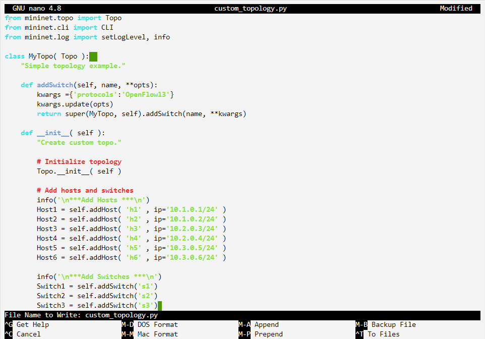

Langkah pengerjaan praktikum:
1. Jalankan program tanpa menggunakan controller dengan file **custom_topo.py** yang telah dibuat.
```
$ sudo mn --controller=none --custom custom_topology.py --topo=mytopo --mac --arp
```
Maka akan jalan seperti berikut ini:
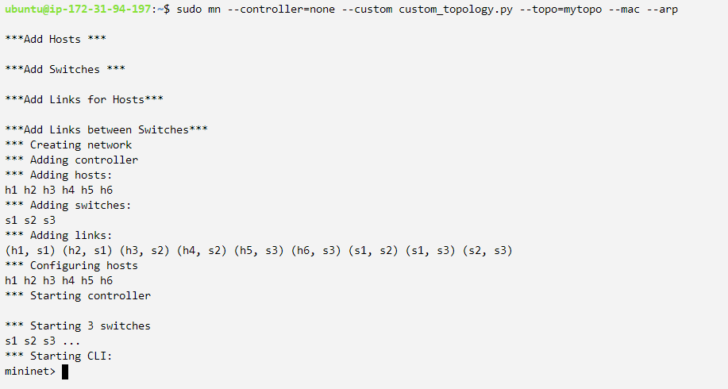

Untuk mengetahui nodes yang telah dibuat kita menggunakan kode:

```
mininet> nodes
```
dan akan keluar tampilan berikut:
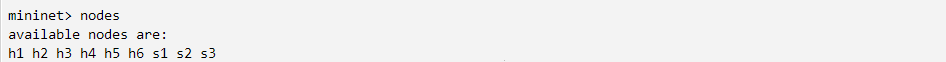
> Keterangan: Nodes terdiri atas **6 Host : h1, h2, h3, h4, h5 dan h6** serta **3 Switch: s1, s2, s3**, dan tidak ada **controller**.

<br><br>
Kemudian untuk mengetahui hubungan, kita dapat menggunakan sintaks dibawah ini
```
mininet> links
```
dan akan keluar tampilan berikut:

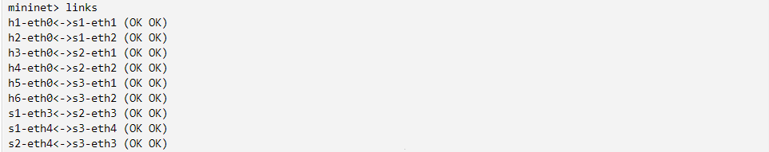

> Keterangan: <br>
> *h1 port 0 terhubung dengan s1 di port 1*<br>
> *h2 port 0 terhubung dengan s1 di port 2*<br>
> *h3 port 0 terhubung dengan s2 di port 1*<br>
> *h4 port 0 terhubung dengan s2 di port 2*<br>
> *h5 port 0 terhubung dengan s3 di port 1*<br>
> *h6 port 0 terhubung dengan s3 di port 2*<br>
><br>
> *s1 port 3 terhubung dengan s2 di port 3*<br>
> *s1 port 4 terhubung dengan s3 di port 4*<br>
> *s2 port 4 terhubung dengan s3 di port 3*<br>

Dapat disimpulkan bahwa keterangan di atas saling terhubung satu sama lainnya.

Sekarang kita akan menggunakan perintah net, untuk mengetahui link lebih detail.

```
mininet> net
```
dan tampilan pada terminal:
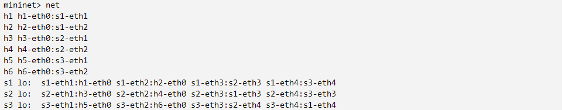
> Perintah `net` sebenarnya sama dengan perintah links, tetapi yang membedakan adalah hubungan atau jalur dan port yang ditampilkan ebih mendetail.

Menggunakan perintah dump untuk melihat lebih detail informasi:
```
mininet> dump
```
dan tampilan pada terminal:
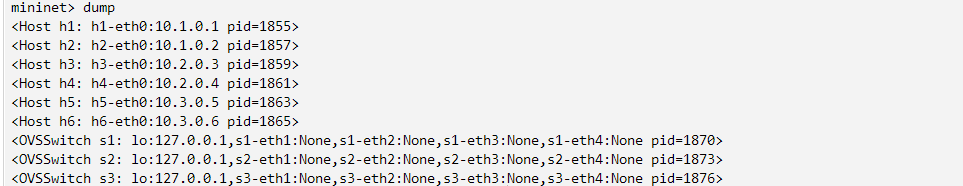

> Dapat diketahui bahwa perintah `dump` akan menampilkan informasi lebih detail setiap nodes. Contoh: <br> *Host h1 memiliki satu buah port dengan nama **eth0**, dan memliki IP: **10.1.0.1** dengan pid=1855.<br>* *Sementara untuk switch menggunakan OVS semua bernilai none, hal ini dikarenakan tidak adanya hubungan.*

Perintah berikut digunakan untuk mengetahui antarmuka h1:
```
mininet> h1 ifconfig
```
dan tampilan pada terminal:
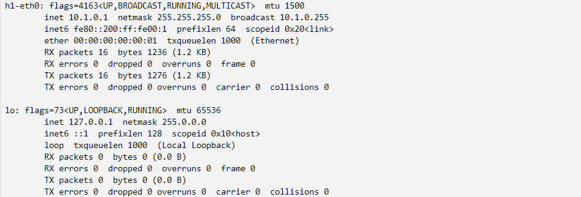
> Perintah ini mengeksekusi perintah ifconfig Linux pada host h1. Perintah menunjukkan
antarmuka host h1. Tampilan menunjukkan bahwa host h1 memiliki antarmuka h1-eth0 yang dikonfigurasi
dengan alamat IP 10.1.0.1, dan antarmuka lain yang dikonfigurasi dengan alamat IP 127.0.0.1
(antarmuka putaran balik).

Kemudian kita melakukan test ping pada semua nodes, dan hasil yang didapatkan sebagai berikut:
```
mininet> pingall
```
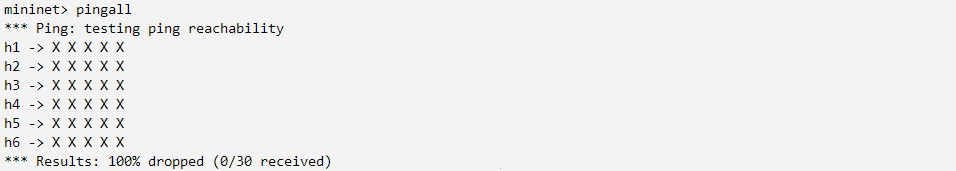

>Didapatkan bahwa semua paket gagal karena semua switch OVS tidak terhubung. Dan tidak ada controller yang mengatur.

Untuk itu, kita perlu men-*set up* beberapa dengan code berikut:
```
mininet> sh ovs-ofctl add-flow s1 -O OpenFlow13 "in_port=1,action=output:2"
mininet> sh ovs-ofctl add-flow s1 -O OpenFlow13 "in_port=2,action=output:1"
```
>Sintaks di atas digunakan untuk membuat aliran dalam switch sehingga semuanya bisa terhubung, dan secara manual.
>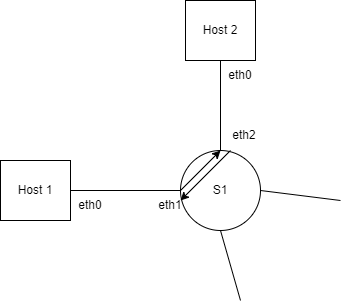

Untuk mengeceknya kita dapat menggunakan lagi sintaks berikut:
```
mininet> h1 ping h2
```
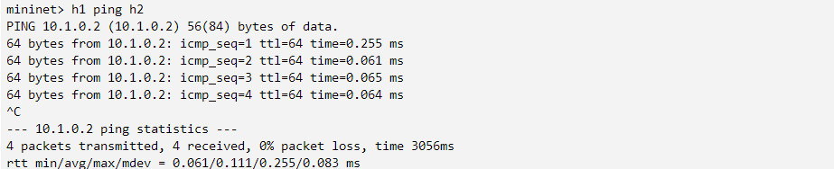
> Note:untuk menghetikan menggunakan perintah CTRL+C

Kesimpulannya, h1 dapat melakukan ping ke h2 melalui s1, begitulah sebaliknya. Dikarenakan sudah didefinisikan untuk membuat aliran. sesuai kode diatas. Sementara host lain tidak dapat melakukan ping dikarenakan belum ada hubungan dapat dilihat setelah mengeceknya lagi dengan `mininet> pingall`. 

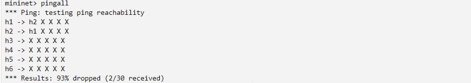

Selamat, **pelajaran 1** telah selesai.

<hr>

# Pelajaran 2: Server Load Balancing
## Apa itu Load Balancer?
Aplikasi Load Balancer yang digunakan pada pengontrol RYU untuk melakukan penyeimbangan beban / load-balanching di seluruh server menggunakan Python.

Contohnya:
*Paket IP dari masing-masing host klien (h3, h4, h5, h6) hingga 10.0.0.100 (IP virtual) dikirim ke host h1 (10.0.0.1) atau host h2 (10.0.0.2) berdasarkan host klien alamat MAC. Jika nilai integer dari alamat MAC klien ganjil (client-MAC-Address % 2 == 1) maka akan dikirim ke h1, sebaliknya ke h2.* Referensi: https://github.com/annakz1/ryu/

Kali ini, kita akan membuat Load Balancer dengan skema berikut:

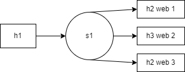

Maka dari itu kita buat file untuk mempersiapkan aplikasi Load Balancer dengan membuat direktori sebagai berikut:
```
$ mkdir load_balancer

~/load_balancer$ nano topo_lb.py
~/load_balancer$ nano rr_lb.py
```
Adapun isi file topo_lb.py sebagai berikut:

```python
from mininet.topo import Topo
from mininet.net import Mininet
from mininet.node import RemoteController
from mininet.util import dumpNodeConnections
from mininet.log import setLogLevel, info
from mininet.cli import CLI
from functools import partial


class MyTopo( Topo ):
    "Simple topology example."
    def addSwitch( self, name, **opts ):
        kwargs = { 'protocols' : 'OpenFlow13'}
        kwargs.update( opts )
        return super(MyTopo, self).addSwitch( name, **kwargs )

    def __init__( self ):
        "Create custom topo."

        # Initialize topology
        Topo.__init__( self )

        # Add hosts and switches
        h1 = self.addHost( 'h1' )
        h2 = self.addHost( 'h2' )
        h3 = self.addHost( 'h3' )
        h4 = self.addHost( 'h4' )
        s1 = self.addSwitch( 's1' )

        # Add links
        self.addLink( h1, s1 )
        self.addLink( h2, s1 )
        self.addLink( h3, s1 )
        self.addLink( h4, s1 )

def run():
    "The Topology for Server - Round Robin LoadBalancing"
    topo = MyTopo()
    net = Mininet( topo=topo, controller=RemoteController, autoSetMacs=True, waitConnected=True )
    
    info("\n***Disabling IPv6***\n")
    for host in net.hosts:
        print("disable ipv6 in", host)
        host.cmd("sysctl -w net.ipv6.conf.all.disable_ipv6=1")
    
    for sw in net.switches:
        print("disable ipv6 in", sw)
        sw.cmd("sysctl -w net.ipv6.conf.all.disable_ipv6=1")

    info("\n***Running Web Servers***\n")
    for web in ["h2", "h3", "h4"]:
        info("Web Server running in", web, net[web].cmd("python -m http.server 80 &"))


    info("\n\n************************\n")
    net.start()
    net.pingAll()
    info("************************\n")
    CLI(net)
    net.stop()

if __name__ == '__main__':
    setLogLevel( 'info' )
    run()
```
Adapun isi file rr_lb.py sebagai berikut:
```python
# Copyright (C) 2011 Nippon Telegraph and Telephone Corporation.
#
# Licensed under the Apache License, Version 2.0 (the "License");
# you may not use this file except in compliance with the License.
# You may obtain a copy of the License at
#
#    http://www.apache.org/licenses/LICENSE-2.0
#
# Unless required by applicable law or agreed to in writing, software
# distributed under the License is distributed on an "AS IS" BASIS,
# WITHOUT WARRANTIES OR CONDITIONS OF ANY KIND, either express or
# implied.
# See the License for the specific language governing permissions and
# limitations under the License.


#Reference: https://bitbucket.org/sdnhub/ryu-starter-kit/src/7a162d81f97d080c10beb15d8653a8e0eff8a469/stateless_lb.py?at=master&fileviewer=file-view-default

import random
from ryu.base import app_manager
from ryu.controller import ofp_event
from ryu.controller.handler import CONFIG_DISPATCHER, MAIN_DISPATCHER
from ryu.controller.handler import set_ev_cls
from ryu.ofproto import ofproto_v1_3
from ryu.lib.packet import packet
from ryu.lib.packet import ethernet
from ryu.lib.packet import ether_types, arp, tcp, ipv4, icmp
from ryu.ofproto import ether, inet
from ryu.ofproto import ofproto_v1_3
#from ryu.app.sdnhub_apps import learning_switch

    
class SimpleSwitch13(app_manager.RyuApp):
    OFP_VERSIONS = [ofproto_v1_3.OFP_VERSION]

    def __init__(self, *args, **kwargs):
        super(SimpleSwitch13, self).__init__(*args, **kwargs)
        self.mac_to_port = {}
        self.serverlist=[]                                                              #Creating a list of servers
        self.virtual_lb_ip = "10.0.0.100"                                               #Virtual Load Balancer IP
        self.virtual_lb_mac = "AB:BC:CD:EF:AB:BC"                                          #Virtual Load Balancer MAC Address
        self.counter = 0                                                                #Used to calculate mod in server selection below
        
        self.serverlist.append({'ip':"10.0.0.2", 'mac':"00:00:00:00:00:02", "outport":"2"})            #Appending all given IP's, assumed MAC's and ports of switch to which servers are connected to the list created 
        self.serverlist.append({'ip':"10.0.0.3", 'mac':"00:00:00:00:00:03", "outport":"3"})
        self.serverlist.append({'ip':"10.0.0.4", 'mac':"00:00:00:00:00:04", "outport":"4"})
        print("Done with initial setup related to server list creation.")
        

    @set_ev_cls(ofp_event.EventOFPSwitchFeatures, CONFIG_DISPATCHER)
    def switch_features_handler(self, ev):
        datapath = ev.msg.datapath
        ofproto = datapath.ofproto
        parser = datapath.ofproto_parser

        # install table-miss flow entry
        #
        # We specify NO BUFFER to max_len of the output action due to
        # OVS bug. At this moment, if we specify a lesser number, e.g.,
        # 128, OVS will send Packet-In with invalid buffer_id and
        # truncated packet data. In that case, we cannot output packets
        # correctly.  The bug has been fixed in OVS v2.1.0.
        match = parser.OFPMatch()
        actions = [parser.OFPActionOutput(ofproto.OFPP_CONTROLLER,
                                          ofproto.OFPCML_NO_BUFFER)]
        self.add_flow(datapath, 0, match, actions)

    def add_flow(self, datapath, priority, match, actions, buffer_id=None):
        ofproto = datapath.ofproto
        parser = datapath.ofproto_parser

        inst = [parser.OFPInstructionActions(ofproto.OFPIT_APPLY_ACTIONS,
                                             actions)]
        if buffer_id:
            mod = parser.OFPFlowMod(datapath=datapath, buffer_id=buffer_id,
                                    priority=priority, match=match,
                                    instructions=inst)
        else:
            mod = parser.OFPFlowMod(datapath=datapath, priority=priority,
                                    match=match, instructions=inst)
        datapath.send_msg(mod)

    def function_for_arp_reply(self, dst_ip, dst_mac):                                      #Function placed here, source MAC and IP passed from below now become the destination for the reply ppacket 
        print("(((Entered the ARP Reply function to build a packet and reply back appropriately)))")
        arp_target_ip = dst_ip
        arp_target_mac = dst_mac
        src_ip = self.virtual_lb_ip                         #Making the load balancers IP and MAC as source IP and MAC
        src_mac = self.virtual_lb_mac

        arp_opcode = 2                          #ARP opcode is 2 for ARP reply
        hardware_type = 1                       #1 indicates Ethernet ie 10Mb
        arp_protocol = 2048                       #2048 means IPv4 packet
        ether_protocol = 2054                   #2054 indicates ARP protocol
        len_of_mac = 6                  #Indicates length of MAC in bytes
        len_of_ip = 4                   #Indicates length of IP in bytes

        pkt = packet.Packet()
        ether_frame = ethernet.ethernet(dst_mac, src_mac, ether_protocol)               #Dealing with only layer 2
        arp_reply_pkt = arp.arp(hardware_type, arp_protocol, len_of_mac, len_of_ip, arp_opcode, src_mac, src_ip, arp_target_mac, dst_ip)   #Building the ARP reply packet, dealing with layer 3
        pkt.add_protocol(ether_frame)
        pkt.add_protocol(arp_reply_pkt)
        pkt.serialize()
        print("{{{Exiting the ARP Reply Function as done with processing for ARP reply packet}}}")
        return pkt
    
    @set_ev_cls(ofp_event.EventOFPPacketIn, MAIN_DISPATCHER)                
    def _packet_in_handler(self, ev):
        # If you hit this you might want to increase
        # the "miss_send_length" of your switch
        if ev.msg.msg_len < ev.msg.total_len:
            self.logger.debug("packet truncated: only %s of %s bytes",
                              ev.msg.msg_len, ev.msg.total_len)
        msg = ev.msg
        datapath = msg.datapath
        ofproto = datapath.ofproto
        parser = datapath.ofproto_parser
        in_port = msg.match['in_port']
        dpid = datapath.id
        #print("Debugging purpose dpid", dpid)
        
        pkt = packet.Packet(msg.data)
        eth = pkt.get_protocols(ethernet.ethernet)[0]

        

        if eth.ethertype == ether_types.ETH_TYPE_LLDP:
            # ignore lldp packet
            return
        if eth.ethertype == 35020:
            return

        if eth.ethertype == ether.ETH_TYPE_ARP:                                   #If the ethernet frame has eth type as 2054 indicating as ARP packet..  
            arp_header = pkt.get_protocols(arp.arp)[0]
            
            if arp_header.dst_ip == self.virtual_lb_ip and arp_header.opcode == arp.ARP_REQUEST:                 #..and if the destination is the virtual IP of the load balancer and Opcode = 1 indicating ARP Request

                reply_packet=self.function_for_arp_reply(arp_header.src_ip, arp_header.src_mac)    #Call the function that would build a packet for ARP reply passing source MAC and source IP
                actions = [parser.OFPActionOutput(in_port)]
                packet_out = parser.OFPPacketOut(datapath=datapath, in_port=ofproto.OFPP_ANY, data=reply_packet.data, actions=actions, buffer_id=0xffffffff)    
                datapath.send_msg(packet_out)
                # print("::::Sent the packet_out::::")

            else:                                                                                #Not needed as we ARP only for the load balancer MAC address. This is needed when we ARP for other device's MAC 
                
                dst = eth.dst
                src = eth.src
                self.mac_to_port.setdefault(dpid, {})

                self.logger.info("packet in %s %s %s %s", dpid, src, dst, in_port)

                # learn a mac address to avoid FLOOD next time.
                self.mac_to_port[dpid][src] = in_port

                if dst in self.mac_to_port[dpid]:
                    out_port = self.mac_to_port[dpid][dst]
                else:
                    out_port = ofproto.OFPP_FLOOD

                actions = [parser.OFPActionOutput(out_port)]

                # install a flow to avoid packet_in next time
                if out_port != ofproto.OFPP_FLOOD:
                    match = parser.OFPMatch(in_port=in_port, eth_dst=dst)

                    # verify if we have a valid buffer_id, if yes avoid to send both
                    # flow_mod & packet_out
                    if msg.buffer_id != ofproto.OFP_NO_BUFFER:
                        self.add_flow(datapath, 1, match, actions, msg.buffer_id)
                        return
                    else:
                        self.add_flow(datapath, 1, match, actions)
                data = None
                if msg.buffer_id == ofproto.OFP_NO_BUFFER:
                    data = msg.data

                out = parser.OFPPacketOut(datapath=datapath, buffer_id=msg.buffer_id,
                                  in_port=in_port, actions=actions, data=data)
                datapath.send_msg(out)
            return
    
        try:
            if pkt.get_protocols(icmp.icmp)[0]:
                dst = eth.dst
                src = eth.src
                self.mac_to_port.setdefault(dpid, {})

                self.logger.info("packet in %s %s %s %s", dpid, src, dst, in_port)

                # learn a mac address to avoid FLOOD next time.
                self.mac_to_port[dpid][src] = in_port

                if dst in self.mac_to_port[dpid]:
                    out_port = self.mac_to_port[dpid][dst]
                else:
                    out_port = ofproto.OFPP_FLOOD

                actions = [parser.OFPActionOutput(out_port)]

                # install a flow to avoid packet_in next time
                if out_port != ofproto.OFPP_FLOOD:
                    match = parser.OFPMatch(in_port=in_port, eth_dst=dst)

                    # verify if we have a valid buffer_id, if yes avoid to send both
                    # flow_mod & packet_out
                    if msg.buffer_id != ofproto.OFP_NO_BUFFER:
                        self.add_flow(datapath, 1, match, actions, msg.buffer_id)
                        return
                    else:
                        self.add_flow(datapath, 1, match, actions)
                data = None
                if msg.buffer_id == ofproto.OFP_NO_BUFFER:
                    data = msg.data

                out = parser.OFPPacketOut(datapath=datapath, buffer_id=msg.buffer_id,
                                  in_port=in_port, actions=actions, data=data)
                datapath.send_msg(out)
            return
        except:
            pass
        
        ip_header = pkt.get_protocols(ipv4.ipv4)[0]
        #print("IP_Header", ip_header)
        tcp_header = pkt.get_protocols(tcp.tcp)[0]
        #print("TCP_Header", tcp_header)

        count = self.counter % 3                            #Round robin fashion setup
        server_ip_selected = self.serverlist[count]['ip']
        server_mac_selected = self.serverlist[count]['mac']
        server_outport_selected = self.serverlist[count]['outport']
        server_outport_selected = int(server_outport_selected)
        self.counter = self.counter + 1
        print("The selected server is ===> ", server_ip_selected)

        
        #Route to server
        match = parser.OFPMatch(in_port=in_port, eth_type=eth.ethertype, eth_src=eth.src, eth_dst=eth.dst, ip_proto=ip_header.proto, ipv4_src=ip_header.src, ipv4_dst=ip_header.dst, tcp_src=tcp_header.src_port, tcp_dst=tcp_header.dst_port)
        actions = [parser.OFPActionSetField(ipv4_src=self.virtual_lb_ip), parser.OFPActionSetField(eth_src=self.virtual_lb_mac), parser.OFPActionSetField(eth_dst=server_mac_selected), parser.OFPActionSetField(ipv4_dst=server_ip_selected), parser.OFPActionOutput(server_outport_selected)]
        inst = [parser.OFPInstructionActions(ofproto.OFPIT_APPLY_ACTIONS, actions)]
        cookie = random.randint(0, 0xffffffffffffffff)
        flow_mod = parser.OFPFlowMod(datapath=datapath, match=match, idle_timeout=7, instructions=inst, buffer_id = msg.buffer_id, cookie=cookie)
        datapath.send_msg(flow_mod)
        print("<========Packet from client: "+str(ip_header.src)+". Sent to server: "+str(server_ip_selected)+", MAC: "+str(server_mac_selected)+" and on switch port: "+str(server_outport_selected)+"========>")  


        #Reverse route from server
        match = parser.OFPMatch(in_port=server_outport_selected, eth_type=eth.ethertype, eth_src=server_mac_selected, eth_dst=self.virtual_lb_mac, ip_proto=ip_header.proto, ipv4_src=server_ip_selected, ipv4_dst=self.virtual_lb_ip, tcp_src=tcp_header.dst_port, tcp_dst=tcp_header.src_port)
        actions = [parser.OFPActionSetField(eth_src=self.virtual_lb_mac), parser.OFPActionSetField(ipv4_src=self.virtual_lb_ip), parser.OFPActionSetField(ipv4_dst=ip_header.src), parser.OFPActionSetField(eth_dst=eth.src), parser.OFPActionOutput(in_port)]
        inst2 = [parser.OFPInstructionActions(ofproto.OFPIT_APPLY_ACTIONS, actions)]
        cookie = random.randint(0, 0xffffffffffffffff)
        flow_mod2 = parser.OFPFlowMod(datapath=datapath, match=match, idle_timeout=7, instructions=inst2, cookie=cookie)
        datapath.send_msg(flow_mod2)
        print("<++++++++Reply sent from server: "+str(server_ip_selected)+", MAC: "+str(server_mac_selected)+". Via load balancer: "+str(self.virtual_lb_ip)+". To client: "+str(ip_header.src)+"++++++++>")
```

### Environtment untuk melakukan SPLIT Terminal

 Ketik sintaks berikut di dalam terminal
```
$ tmux
```
>Note: untuk vertikal split di tmux dapat menggunakan **CTRL B + %**. Selengkapnya dapat dilihat di https://tmuxcheatsheet.com/

Maka tampilan akan menjadi:
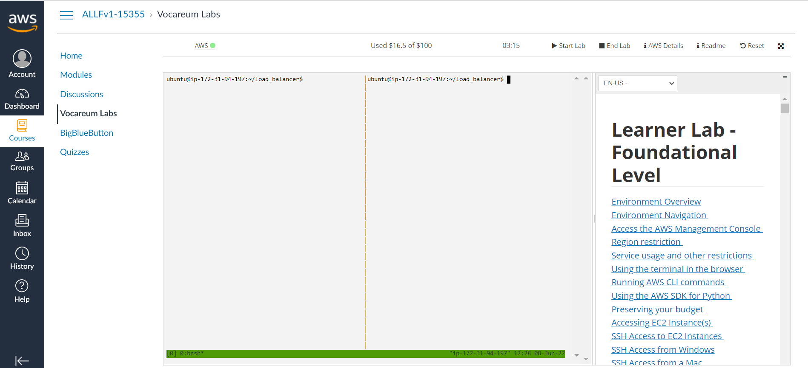

### Langkah-langkah praktikum:
1. Jalankan mininet dengan program dengan perintah pada salah satu terminal console:
```
sudo python3 topo_lb.py
```
2. alankan aplikasi `rr_lb.py` pada Ryu controller dengan `ryu-manager` pada terminal console lainnya:
```
ryu-manager rr_lb.py
```
Maka tampilan akan terlihat seperti ini:
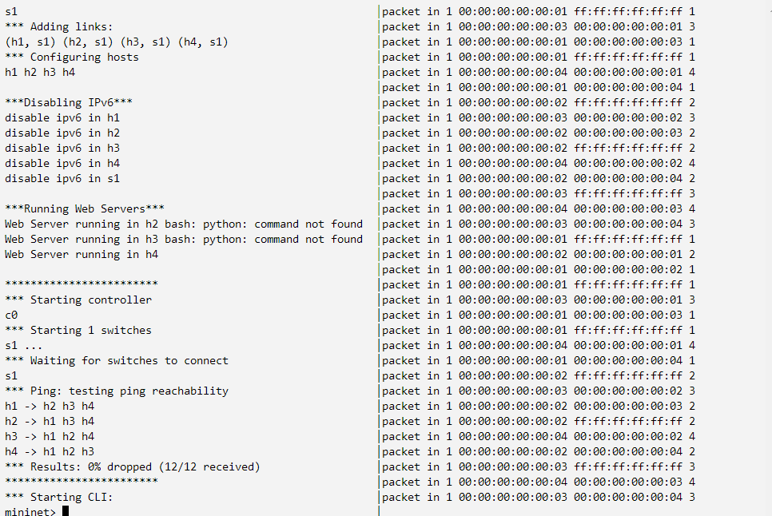
>Keterangan: Terminal Kiri menjalankan Topologi dan terminal kanan menjalankan RYU.

Pada program **topo_lb.py** akan membentuk topologi seperti gambar di atas. yang terdiri atas 4 hosts (h1 - h4) dan 1 switch (s1) dengan skenario sebagai berikut:

- h1 sebagai web client
- h2 sebagai web server `mininet> h2 python3 -m http.server 80 &`
- h3 sebagai web server `mininet> h3 python3 -m http.server 80 &`
- h4 sebagai web server `mininet> h4 python3 -m http.server 80 &`

Maka terminal akan menampilkan:
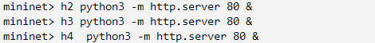

Pada program **rr_lb.py** secara umum akan mengeksekusi

- Virtual server pada IP 10.0.0.100
- Menentukan h2, h3, dan h4 sebagai server tujuan
- Menggunakan round-robin untuk meneruskan setiap tcp request baru ke server yang dipilih

Untuk mengetahui hubungan kita cek menggunakan perintah-perintah berikut ini:
```
mininet> dump
mininet> links
mininet> net
```
Maka hasilnya seperti berikut:
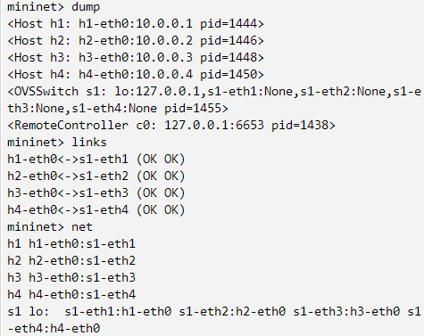

Selanjutnya lakukan percobaan pada mininet console:
```
mininet> h1 curl 10.0.0.100
```
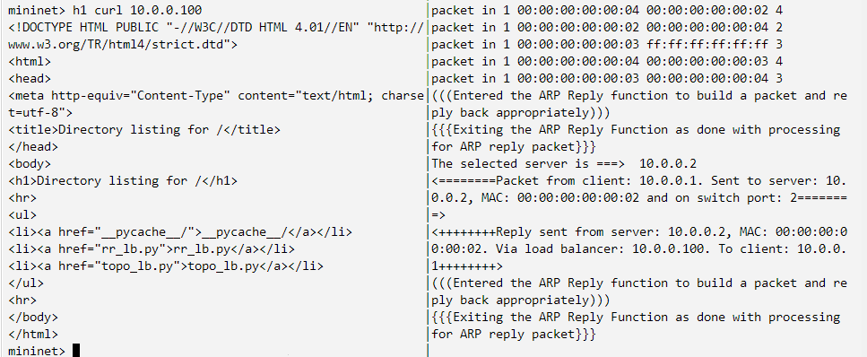
> Keterangan bahwa server yang dipilih adalah server h2, hal ini dibuktikan bahwa *selected server is h2 with ip 10.0.0.2. Melalui IP 10.0.0.100.

Selanjutnya lakukan percobaan kembali pada mininet console:
```
mininet> h1 curl 10.0.0.100
```

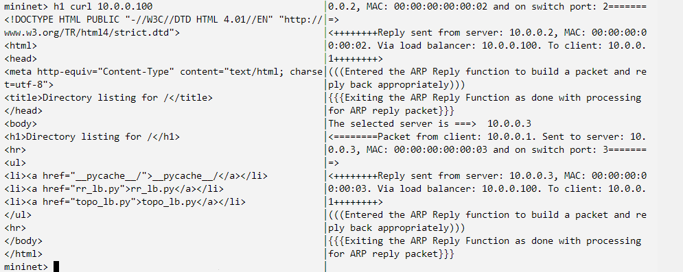

> Keterangan bahwa server yang dipilih adalah server h2, hal ini dibuktikan bahwa *selected server is h2 with ip 10.0.0.3. Melalui IP 10.0.0.100. Hal ini menandakan, walaupun h1 mengakses alamat IP sama, tetapi letak server bisa berganti-ganti.


Kemudian eksekusi perintah berikut:
```
mininet> dpctl dump-flows -O OpenFlow13 
```
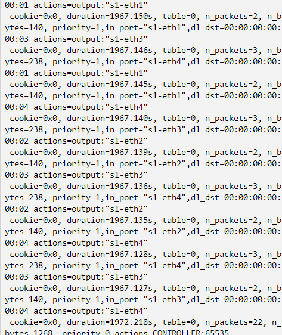

Terakhir, untuk mengecek ARP dapat menggunakan:
```
mininet> h1 arp -a
```
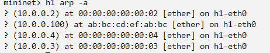

## Apa itu ARP?
Apa yang dimaksud dengan ARP?
ARP *(Address Resolution Protocol)* adalah protokol yang digunakan untuk menerjemah alamat IP menjadi alamat MAC pada Local Area Network. Sebuah host akan mengirimkan ARP request secara broadcast untuk mendapatkan alamat MAC host tujuan.

Selamat, **Pelajaran 2** telah selesai.
<hr>

# Pelajaran 3: Aplikasi Ryu  Shortest Path Routing

Kali ini kita akan menggunakan algoritma dijkstra pada ryu controller untuk menemukan jalur terpendek. 

Maka dari itu kita buat file untuk mempersiapkan aplikasi SPF dengan membuat direktori sebagai berikut:
```
$ mkdir SPF

~/SPF$ nano dijkstra_Ryu_controller.py
~/SPF$ nano topo-spf_lab.py
```

Adapun isi dijkstra_Ryu_controller.py sebagai berikut:

```python
from ryu.base import app_manager
from ryu.controller import ofp_event
from ryu.controller.handler import CONFIG_DISPATCHER, MAIN_DISPATCHER
from ryu.controller.handler import set_ev_cls
from ryu.ofproto import ofproto_v1_3
from ryu.lib.mac import haddr_to_bin
from ryu.lib.packet import packet
from ryu.lib.packet import ethernet
from ryu.lib.packet import ether_types
from ryu.lib import mac
from ryu.topology.api import get_switch, get_link
from ryu.app.wsgi import ControllerBase
from ryu.topology import event, switches
from collections import defaultdict

# switches
switches = []

# mymacs[srcmac]->(switch, port)
mymacs = {}

# adjacency map [sw1][sw2]->port from sw1 to sw2
adjacency = defaultdict(lambda:defaultdict(lambda:None))


# getting the node with lowest distance in Q
def minimum_distance(distance, Q):
    min = float('Inf')
    node = 0
    for v in Q:
        if distance[v] < min:
            min = distance[v]
            node = v
    return node

 

def get_path (src, dst, first_port, final_port):
    # executing Dijkstra's algorithm
    print( "get_path function is called, src=", src," dst=", dst, " first_port=", first_port, " final_port=", final_port)
    
    # defining dictionaries for saving each node's distance and its previous node in the path from first node to that node
    distance = {}
    previous = {}

    # setting initial distance of every node to infinity
    for dpid in switches:
        distance[dpid] = float('Inf')
        previous[dpid] = None

    # setting distance of the source to 0
    distance[src] = 0

    # creating a set of all nodes
    Q = set(switches)

    # checking for all undiscovered nodes whether there is a path that goes through them to their adjacent nodes which will make its adjacent nodes closer to src
    while len(Q) > 0:
        # getting the closest node to src among undiscovered nodes
        u = minimum_distance(distance, Q)
        # removing the node from Q
        Q.remove(u)
        # calculate minimum distance for all adjacent nodes to u
        for p in switches:
            # if u and other switches are adjacent
            if adjacency[u][p] != None:
                # setting the weight to 1 so that we count the number of routers in the path
                w = 1
                # if the path via u to p has lower cost then make the cost equal to this new path's cost
                if distance[u] + w < distance[p]:
                    distance[p] = distance[u] + w
                    previous[p] = u

    # creating a list of switches between src and dst which are in the shortest path obtained by Dijkstra's algorithm reversely
    r = []
    p = dst
    r.append(p)
    # set q to the last node before dst 
    q = previous[p]
    while q is not None:
        if q == src:
            r.append(q)
            break
        p = q
        r.append(p)
        q = previous[p]

    # reversing r as it was from dst to src
    r.reverse()

    # setting path 
    if src == dst:
        path=[src]
    else:
        path=r

    # Now adding in_port and out_port to the path
    r = []
    in_port = first_port
    for s1, s2 in zip(path[:-1], path[1:]):
        out_port = adjacency[s1][s2]
        r.append((s1, in_port, out_port))
        in_port = adjacency[s2][s1]
    r.append((dst, in_port, final_port))
    return r

 

class ProjectController(app_manager.RyuApp):
    OFP_VERSIONS = [ofproto_v1_3.OFP_VERSION]

    def __init__(self, *args, **kwargs):
        super(ProjectController, self).__init__(*args, **kwargs)
        self.topology_api_app = self
        self.datapath_list = []

    def install_path(self, p, ev, src_mac, dst_mac):
       print("install_path function is called!")
       #print( "p=", p, " src_mac=", src_mac, " dst_mac=", dst_mac)
       msg = ev.msg
       datapath = msg.datapath
       ofproto = datapath.ofproto
       parser = datapath.ofproto_parser
       # adding path to flow table of each switch inside the shortest path
       for sw, in_port, out_port in p:
            #print( src_mac,"->", dst_mac, "via ", sw, " in_port=", in_port, " out_port=", out_port)
            # setting match part of the flow table
            match = parser.OFPMatch(in_port=in_port, eth_src=src_mac, eth_dst=dst_mac)
            # setting actions part of the flow table
            actions = [parser.OFPActionOutput(out_port)]
            # getting the datapath
            datapath = self.datapath_list[int(sw)-1]
            # getting instructions based on the actions
            inst = [parser.OFPInstructionActions(ofproto.OFPIT_APPLY_ACTIONS , actions)]
            mod = datapath.ofproto_parser.OFPFlowMod(datapath=datapath, match=match, idle_timeout=0, hard_timeout=0,
                                                     priority=1, instructions=inst)
            # finalizing the change to switch datapath
            datapath.send_msg(mod)

 
    # defining event handler for setup and configuring of switches
    @set_ev_cls(ofp_event.EventOFPSwitchFeatures , CONFIG_DISPATCHER)
    def switch_features_handler(self , ev):
        print("switch_features_handler function is called")
        # getting the datapath, ofproto and parser objects of the event
        datapath = ev.msg.datapath
        ofproto = datapath.ofproto
        parser = datapath.ofproto_parser
        # setting match condition to nothing so that it will match to anything
        match = parser.OFPMatch()
        # setting action to send packets to OpenFlow Controller without buffering
        actions = [parser.OFPActionOutput(ofproto.OFPP_CONTROLLER, ofproto.OFPCML_NO_BUFFER)]
        inst = [parser.OFPInstructionActions(ofproto.OFPIT_APPLY_ACTIONS , actions)]
        # setting the priority to 0 so that it will be that last entry to match any packet inside any flow table
        mod = datapath.ofproto_parser.OFPFlowMod(
                            datapath=datapath, match=match, cookie=0,
                            command=ofproto.OFPFC_ADD, idle_timeout=0, hard_timeout=0,
                            priority=0, instructions=inst)
        # finalizing the mod 
        datapath.send_msg(mod)

 
    # defining an event handler for packets coming to switches event
    @set_ev_cls(ofp_event.EventOFPPacketIn, MAIN_DISPATCHER)
    def _packet_in_handler(self, ev):
        # getting msg, datapath, ofproto and parser objects
        msg = ev.msg
        datapath = msg.datapath
        ofproto = datapath.ofproto
        parser = datapath.ofproto_parser
        # getting the port switch received the packet with
        in_port = msg.match['in_port']
        # creating a packet encoder/decoder class with the raw data obtained by msg
        pkt = packet.Packet(msg.data)
        # getting the protocl that matches the received packet
        eth = pkt.get_protocol(ethernet.ethernet)

        # avoid broadcasts from LLDP 
        if eth.ethertype == 35020 or eth.ethertype == 34525:
            return

        # getting source and destination of the link
        dst = eth.dst
        src = eth.src
        dpid = datapath.id
        print("packet in. src=", src, " dst=", dst," dpid=", dpid)

        # add the host to the mymacs of the first switch that gets the packet
        if src not in mymacs.keys():
            mymacs[src] = (dpid, in_port)
            print("mymacs=", mymacs)

        # finding shortest path if destination exists in mymacs
        if dst in mymacs.keys():
            print("destination is known.")
            p = get_path(mymacs[src][0], mymacs[dst][0], mymacs[src][1], mymacs[dst][1])
            self.install_path(p, ev, src, dst)
            print("installed path=", p)
            out_port = p[0][2]
        else:
            print("destination is unknown.Flood has happened.")
            out_port = ofproto.OFPP_FLOOD

        # getting actions part of the flow table
        actions = [parser.OFPActionOutput(out_port)]

        data = None
        if msg.buffer_id == ofproto.OFP_NO_BUFFER:
            data = msg.data
        out = parser.OFPPacketOut(datapath=datapath, buffer_id=msg.buffer_id, in_port=in_port,
                                  actions=actions, data=data)
        datapath.send_msg(out)

    
    # defining an event handler for adding/deleting of switches, hosts, ports and links event
    events = [event.EventSwitchEnter,
              event.EventSwitchLeave, event.EventPortAdd,
              event.EventPortDelete, event.EventPortModify,
              event.EventLinkAdd, event.EventLinkDelete]
    @set_ev_cls(events)
    def get_topology_data(self, ev):
        global switches
        print("get_topology_data is called.")
        # getting the list of known switches 
        switch_list = get_switch(self.topology_api_app, None)  
        switches = [switch.dp.id for switch in switch_list]
        print("current known switches=", switches)
        # getting the list of datapaths from the list of switches
        self.datapath_list = [switch.dp for switch in switch_list]
        # sorting the datapath list based on their id so that indexing them in install_function will be correct
        self.datapath_list.sort(key=lambda dp: dp.id)

        # getting the list of links between switches
        links_list = get_link(self.topology_api_app, None)
        mylinks = [(link.src.dpid,link.dst.dpid,link.src.port_no,link.dst.port_no) for link in links_list]

        # setting adjacency of nodes
        for s1, s2, port1, port2 in mylinks:
            adjacency[s1][s2] = port1
            adjacency[s2][s1] = port2
```

Adapun isi topo-spf_lab.py sebagai berikut:

```python
#!/usr/bin/env python

from mininet.topo import Topo
from mininet.net import Mininet
from mininet.node import RemoteController
from mininet.util import dumpNodeConnections
from mininet.log import setLogLevel, info
from mininet.cli import CLI
from functools import partial

class MyTopo( Topo ):
    "Tugas SDN04 Finding Shortest Paths."

    def addSwitch( self, name, **opts ):
        kwargs = { 'protocols' : 'OpenFlow13'}
        kwargs.update( opts )
        return super(MyTopo, self).addSwitch( name, **kwargs )

    def __init__( self ):
        # Inisialisasi Topology
        "Custom Topology 3 Switch 6 Host - Topology Ring"
        Topo.__init__( self )

        # Add hosts
        info('*** Add Hosts\n')
        h1 = self.addHost( 'h1',ip='10.1.0.1/8' )
        h2 = self.addHost( 'h2',ip='10.1.0.2/8' )
        h3 = self.addHost( 'h3',ip='10.2.0.3/8' )
        h4 = self.addHost( 'h4',ip='10.2.0.4/8' )
        h5 = self.addHost( 'h5',ip='10.3.0.5/8' )
        h6 = self.addHost( 'h6',ip='10.3.0.6/8' )

	# Add switches
        s1 = self.addSwitch( 's1' )
        s2 = self.addSwitch( 's2' )
        s3 = self.addSwitch( 's3' )
        s4 = self.addSwitch( 's4' )
        s5 = self.addSwitch( 's5' )
        s6 = self.addSwitch( 's6' )

        # Add links host to switch
        self.addLink( s1, h1, 1, 1 )
        self.addLink( s2, h2, 1, 1 )
        self.addLink( s3, h3, 1, 1 )
        self.addLink( s4, h4, 1, 1 )
        self.addLink( s5, h5, 1, 1 )
        self.addLink( s6, h6, 1, 1 )
        # Add links switch to switch
        self.addLink( s1, s2, 2, 2 )
        self.addLink( s1, s3, 3, 2 )
        self.addLink( s2, s4, 3, 2 )
        self.addLink( s2, s5, 4, 2 )
        self.addLink( s3, s4, 3, 3 )
        self.addLink( s3, s6, 4, 2 )
        self.addLink( s4, s5, 4, 3 )
        self.addLink( s4, s6, 5, 3 )

def run():
    "The Topology for Server - Round Robin LoadBalancing"
    topo = MyTopo()
    net = Mininet( topo=topo, controller=RemoteController, autoSetMacs=True, autoStaticArp=True, waitConnected=True )
    
    info("\n***Disabling IPv6***\n")
    for host in net.hosts:
        print("disable ipv6 in", host)
        host.cmd("sysctl -w net.ipv6.conf.all.disable_ipv6=1")
    
    for sw in net.switches:
        print("disable ipv6 in", sw)
        sw.cmd("sysctl -w net.ipv6.conf.all.disable_ipv6=1")

    info("\n\n************************\n")
    net.start()
    CLI(net)
    net.stop()

if __name__ == '__main__':
    setLogLevel( 'info' )
    run()
```
## Langkah-langkah praktikum:
1. Lakukanlah mode `mininet> tmux` seperti pelajaran 2.
2. Apabila sudah membuka split windows maka akan tampil seperti ini:
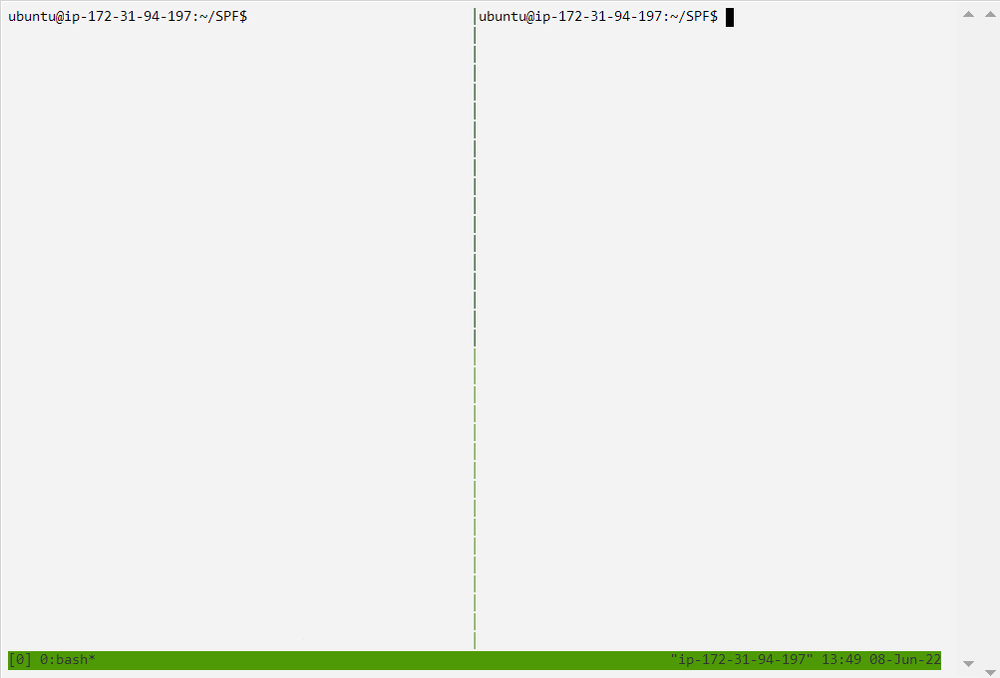

3. Masukkan perintah berikut pada terminal 1.
```
$ ryu-manager --observe-links dijkstra_Ryu_controller.py
```
4. Masukkan perintah berikut pada terminal 2.
```
$ sudo python3 topo-spf_lab.py
```
Maka hasil percobaan akan tampak:
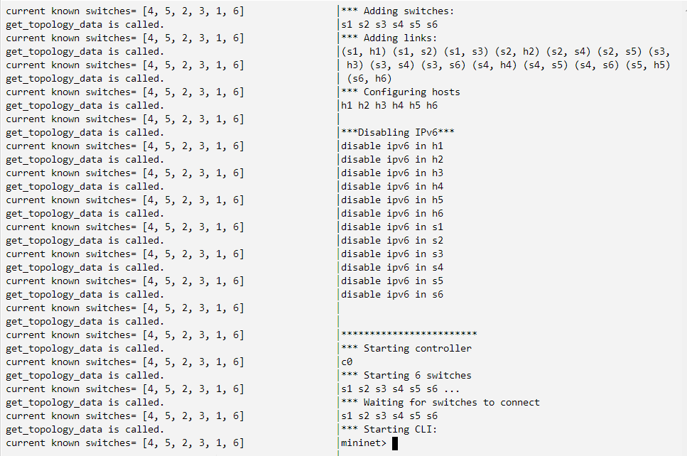

5. Melakukan test ping pada seluruhnya

```
mininet> pingall
```
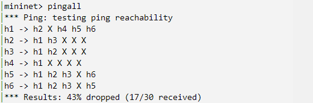
>Ternyata tidak semua paket dapat terkirim dan diterima.

6. Melakukan cek ping
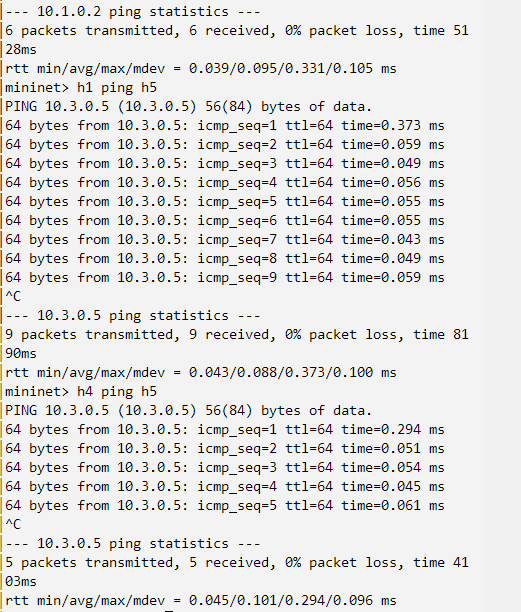
>Setelah melakukan ping berbagai host ternyata paket masih bisa berjalan.

7. Melakukan pingall lagi.
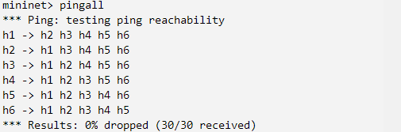
>Semua paket dapat dikirimkan.

Kesimpulan, adapun langkah 5 mengapa pingall tidak berhasil 100%, karena program masih dieksekusi, sehingga tidak semua dapat terakses. Sementara itu, saat langkah 7 dijalankan kembali, maka paket perhasil tidak ada yang loss. Untuk mengetahui paket loss dan received, dapat juga dilihat melalui ipconfig.

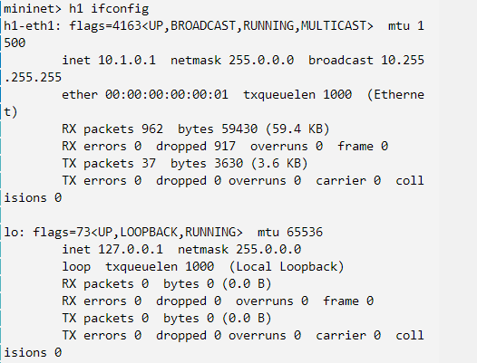
> Keterangan:
> - Paket sebesar : 962 dengan bytes sebesar 59430 (59.4 KB)
> - Tidak ada paket loss
> - ip : 10.0.0.1 dengan broadcast 10.255.255.255

Istilah | Penjelasan
---|--
Interface | menampilkan antarmuka radio, VAP, dan SSID (dalam tanda kurung)
MAC Address | menampilkan alamat MAC dari antarmuka tertentu.
Tx Data | menampilkan jumlah data yang dikirimkan.
 Rx Data | menampilkan jumlah data yang diterima.
 Tx Packets | menampilkan jumlah paket yang dikirimkan.
 Rx Packets | menampilkan jumlah paket yang diterima.
 TX Errors | menampilkan jumlah kesalahan TX.
 Rx Errors | menampilkan jumlah kesalahan RX.

Selamat, **Pelajaran 3** telah selesai.
