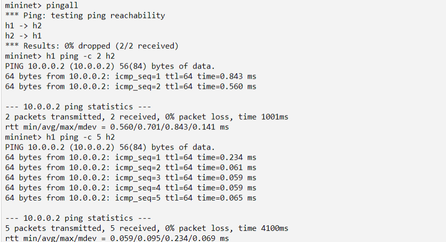

# Rangkuman Arsitektur Jaringan Terkini

Tugas Akhir AJT Mahasiswa Tekkom Universitas Brawijaya

Author: Adytia Candra WIbawa
<hr>

# Langkah Awal Persiapan

Sebelum memulai praktikum, kita terlebih dahulu menyiapkan insfrastruktur dan media yang dibutuhkan menggunakan mesin  AWS EC2. Untuk menjalankan terlebih dahulu kita membuka website berikut:

[AWS ACADEMY](https://awsacademy.instructure.com/)

Maka akan masuk seperti tampilan berikut:


>Note: Silahkan pilih yang student Login, kemudia Masuk sesuai akun Anda. 

Kemudian maka akan tampil halaman berikut ini:


>Note: Pilih kelas sesuai arahan Dosen Anda.

Setelah semuanya selesai, maka langkah selanjutnya adalah menjalankan __Vocareum Labs__, dan akan masuk ke dalam halaman pengkodingan. Untuk lebih jelasnya, akan dijelaskan pada bab berikutnya bagaimana cara membuat mesin __EC2__ melalui __Vocareum Labs__.

Untuk mmelihat __Vocareum Labs__ dapat dilakukan dengan masuk ke:

**Course** > **Vocareum Labs**
<hr>

## Membuat Mesin EC2 Melalui Vocareum Labs di AWS ACADEMY

Setelah Anda masuk __Vocareum Labs__ akan masuk ke dalam halaman pengkodingan seperti berikut ini:


Secara umum halaman di Vocareum Labs, membantu kita untuk melakukan pengkodingan langsung pada mesin yang akan dibuat. Dalam Vocareum Labs terdapat beberapa tombol yang akan dijelaskan sebagai berikut.

- **Start Lab** : Digunakan untuk memulai menjalankan mesin AWS.
- **End Lab** : Digunakan untuk mengakhiri mesin AWS, agar kredit tidak terus bertambah.
- **Time** : Mengetahui waktu penggunaan mesin yang telah dijalankan *(Waktu ini memiliki waktu hitung mundur selama **4 Jam**, perhatikan waktu ini karena akan mempengaruhi kredit Anda)*.
- **Credit** : Kredit ini dapat digunakan untuk melihat status kredit yang digunakan, untuk free tier *(Amazon hanya memberi **$100**)*. Jadi gunakan secara baik-baik.
- **AWS Indicator** : Tekan tombol ini masuk dan memilih mesin EC2. Selain itu, digunakan untuk mengetahui apakah mesin AWS sudah berjalan atau tidak. 
    
    - **Merah** : Mesin AWS tidak berjalan.
    - **Hijau** : Mesin AWS berjalan.

Langkah selanjutnya, adalah kita menekan tombol **AWS**, kemudian akan membuat mesin dengan spesifikasi berikut:

- Name and tags: **Tugas Akhir**
- OS Images: **Ubuntu Server 22.04 LTS 64 bit**
- Instance type: **t2.medium**
- Key pair: **vockey**
- Edit Network settings: **allow SSH, allow HTTP, allow HTTPS, allow TCP port 8080, allow TCP port 8081**
- Configure storage: **30 GiB, gp3**


Pertama, kita masuk ke **AWS**, kemudian pilih **EC2**, kemudian **Instances** dan menampilkan halaman berikut:


>Note: Pilih **Launch Instances** untuk membuat mesin baru.

Kedua, langkah-langkah untuk membuat 1 mesin **EC2 Instance** di AWS Console sebagai berikut:

1. Pilih AMI (Amazon Machine Image):
    
    >Note: **Ubuntu Server 20.04 LTS (HVM), SSD Volume Type**
2. Pilih Instance type **t2.medium**:
    
3. Tambahkan penyimpanan:
    
    >Note: Configure storage: **30 GiB, gp3**
4. Tuliskan nama Tags: 
    
    >Note: Name and tags: **Tugas Akhir**
5. Pilih port dari *Network Setting* sebagai berikut:
    
    >
6. Kemudian pilih **Review** dan **Launch**. Maka akan tampil halaman berikut ini, kita memilih *key pair* secara default yaitu __Vockey__.
    

Selamat, mesin Anda telah dibuat dan akan masuk ke daftar mesin yang telah Anda buat. Langkah selanjutnya, kita akan menginstall beberapa aplikasi dalam Linux, yang akan digunakan untuk langkah praktikum. 

*Note: Jangan lupa untuk memeriksa update software. Dengan perintah*
```
sudo apt -yy update && sudo apt -yy upgrade
```


<hr>

# Instalasi Mininet

## Apakah itu Mininet?
Mininet adalah sebuah emulator jaringan yang dapat digunakan untuk membuat sebuah jaringan virtual (dapat terdiri atas *host*, *switch*, *router*, *controller*, dan *link*). Host pada mininet menjalankan software Linux standar dan switch pada mininet mendukung protokol **OpenFlow** yang sangat fleksibel untuk dimodifikasi dan mendukung Software-Defined Networking (SDN). Lebih lanjut dapat merujuk ke http://mininet.org/overview/

Untuk melakukan instalasi pada Mesin kita dapat masuk ke **Terminal AWS** dan menghubungkan mesin yang telah dibuat tadi.

>Pilih mesin kemudian klik **Connect** akan masuk sebagai berikut. 
>Kemudian Jalankan dengan perintah pada terminal berikut:
>``` 
>ssh -i .ssh/labsuser.pem ubuntu@ec2-52-91-249-20.compute-1.amazonaws.com
>```
>Maka akan keluar halaman seperti berikut ini.
>image.png

Langkah-langkah instalasi Mininet:
1. Melakukan clone aplikasi Mininet pada github dengan sintaks berikut
```
git clone https://github.com/mininet/mininet
```


> Mengunduh repositori mininet, dalam contoh untuk version mininet 2.3.0
2. Install Mininet dengan sintaks berikut
```
mininet/util/install.sh -nfv
```


>Instalasi untuk mininet, user switch dan OpenFlow

<hr>

# Instalasi RYU Controller

## Apa itu RYU?
Ryu adalah sebuah framework software untuk SDN Controller dan pengembangan aplikasi SDN dan menyediakan beragam komponen software lengkap dengan API yang memudahkan pengembang melakukan pembuatan aplikasi berbasis controller SDN. Referensi lebih lanjut dapat mengakses https://ryu-sdn.org/

Langkah-langkah instalasi RYU:
1. Melakukan clone aplikasi RYU pada github dengan sintaks berikut
```
git clone https://github.com/osrg/ryu.git
```


> Mengunduh repositori ryu
2. Install RYU dengan sintaks berikut
```
cd ryu
pip install .
cd
```


<hr>

# Instalasi Flow Manager

## Apa itu Flow Manager?
FlowManager adalah aplikasi pengontrol RYU yang memberikan kontrol manual pengguna atas tabel aliran di jaringan OpenFlow. Pengguna dapat membuat, memodifikasi, atau menghapus alur langsung dari aplikasi. Pengguna juga dapat memantau sakelar OpenFlow dan melihat statistik. FlowManager sangat ideal untuk mempelajari OpenFlow di lingkungan lab, atau bersama dengan aplikasi lain untuk mengubah perilaku alur jaringan di lingkungan pengujian. Referensi lebih lanjut dapat mengunjungi https://github.com/martimy/flowmanager/

Langkah-langkah melakukan clone FlowManager pada terminal dengan sintaks berikut
```
git clone https://github.com/martimy/flowmanager
cd
```


<hr>

Semua bahan telah di download dan di install. Kemudian lakukanlah praktikum seseuai dengan aplikasi yang ingin anda buat. 

> *Note: Setelah langkah instalasi Flowmanager, sebaiknya lakukan rebooting Linux anda untuk membuat lingkungan operasional Python, Mininet, Ryu dan OpenFlow dapat berjalan dengan baik.*

<br>
<br>

# Menjalankan Mininet
Sebelum mengikuti prosedur berikutnya, perlu memperhatikan hal berikut:

Perintah | Keterangan
---|---
|`$` | user shell prompt, dimana setelahnya anda akan mengetikkan perintah-perintah Linux |
|`mininet>` | mininet CLI prompt, dimana setelahnya anda akan mengetikkan perintah-perintah pada Mininet
| `#` | root shell prompt, dimana setelahnya anda akan mengetikkan perintah-perintah Linux pada level akun root *(berbeda dengan akun user biasa)*

>*Note : Setiap perintah dijalankan / dieksekusi, maka harus diakhiri dengan tombol enter*

Untuk menjalankan mininet terlebih dahulu pastikan terminal terhubung dengan mesin. 

Untuk membuat sebuah topologi ketikan kode berikut:
```
$ sudo mn
```
Perintah tersebut akan menjalankan program di bawah ini :


Program di atas dapat diamati secara tampilan sebagai berikut:


> Keterangan: Dalam program di atas, kita membuat dua host yang bernama **h1** dan **h2**, kemudian membuat satu controller yang bernama **c0** dan satu switch yang bernama **s1**. 

Untuk mengetahui semua **nodes** maka dapat menggunakan sintaks berikut:
```
mininet> nodes
```
Untuk mengetahui **links** pada node maka dapat menggunakan sintaks berikut:
```
mininet> net
```
Untuk mengetahui informasi **informasi nodes** maka dapat menggunakan sintaks berikut:
```
mininet> dump
```
Contoh kode yang telah dijalankan:

>Keterangan:
> 
>- Pada perintah nodes, dapat diketahui hasil nnya ialah sebagai berikut: **c0** adalah controller, **h1** dan **h2** adalah host, **s1** adalah switch. 
> - Pada perintah net, dapat diketahui hubungan atau link, sebagai berikut: h1 dihubungkan melalui port h1-eth0 dengan s1-eth1 dan h2 dihubungkan dengan port h2-eth0 dengan s1-eth2. 
>- Pada perintah dump ditampilkan informasi host dan switch beserta alamat ip dan pid-nya. 

Untuk mengetahui sintaks lebih banyak dapat mengakses kode berikut:
```
mininet> help
```


<br>
<br>

## Tes Ping Pada Mininet

Jalankan kode berikut:
```
mininet> pingall
mininet> h1 ping -c 2 h2
```

>Keterangan:
> 
> - Pada perintah pingall dapat diartikan semua node saling ping, apabila berhasil maka akan ada hubungan.
> - Pada perintah h1 ping - c 5 h2, dapat diartikan h1 melakukan ping ke h2, menggunakan controller, dengan 5 kali ping.
> - Saat perintah tersebut dijalanlkan dapat dilihat waktu pengiriman selama beberapa ms, terdapat informasi mengenai packet loss dan berapa paket yang berhasil ditransmisikan. 

Untuk mengakhiri CLI Mininet dapat menggunakan perintah:
```
mininet> exit
```
<br>
<hr>


